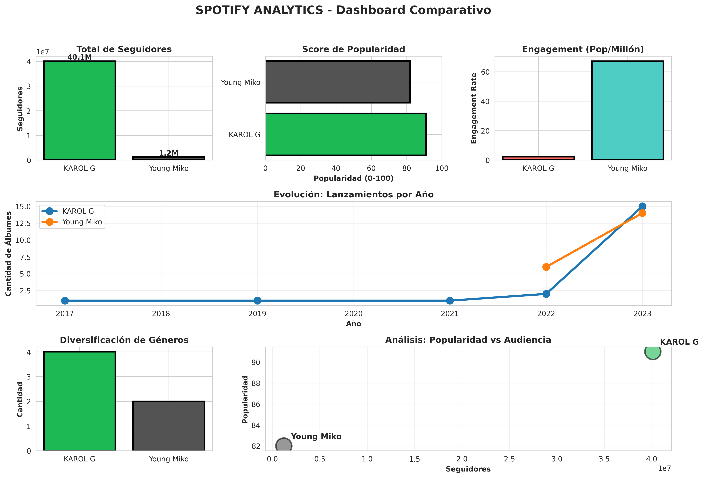
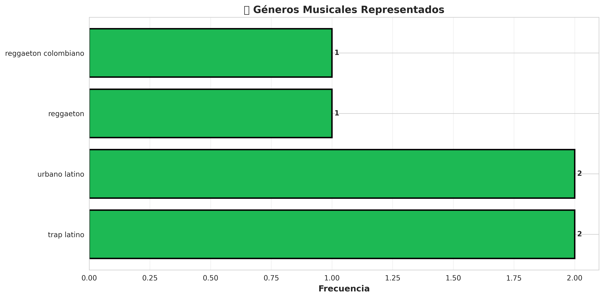

# 🎵 Spotify Music Analytics - Portfolio Project

<div align="center">


**Análisis comparativo de artistas latinos usando Spotify API**

[Ver Dashboard](#-visualizaciones) • [Ver Insights](#-insights-principales) • [Ejecutar Proyecto](#-cómo-ejecutar)

</div>

---

## 📌 Descripción del Proyecto

Pipeline ETL completo que extrae, transforma y analiza datos de artistas musicales desde Spotify API. El proyecto incluye:

- ✅ Extracción de datos vía Spotify Web API
- ✅ Limpieza y transformación con Pandas
- ✅ Análisis de métricas avanzadas (engagement rate, diversificación)
- ✅ Visualizaciones profesionales con Matplotlib/Seaborn
- ✅ Generación automática de insights y reportes

## 🎯 Objetivos

1. Comparar métricas de popularidad entre artistas
2. Calcular engagement rate (popularidad normalizada por audiencia)
3. Analizar evolución temporal de lanzamientos
4. Identificar patrones en diversificación de géneros
5. Generar insights automáticos para toma de decisiones

## 🛠️ Stack Tecnológico

| Tecnología | Uso |
|------------|-----|
| **Python 3.x** | Lenguaje principal |
| **Pandas** | Manipulación y análisis de datos |
| **Matplotlib/Seaborn** | Visualizaciones |
| **Spotify API** | Extracción de datos |
| **SQLAlchemy** | Conexión a bases de datos |
| **Docker** | Containerización |
| **Apache Airflow** |En construccion - Orquestación de pipelines |

## 📊 Datos Analizados

```
✓ 2 Artistas principales
✓ 40 Álbumes
✓ 10 Top Tracks
✓ 6 años de datos históricos (2017-2023)
✓ 183 países de disponibilidad
✓ Métricas: Followers, Popularity, Genres, Release Dates
```

## 💡 Insights Principales

### 🏆 Resultados Clave

| Métrica | KAROL G | Young Miko |
|---------|----------|------------|
| **Seguidores** | 40.1M | 1.2M |
| **Popularidad** | 91/100 | 82/100 |
| **Engagement Rate** | 2.27 | 67.21 ⭐ |
| **Géneros** | 4 | 2 |
| **Álbumes** | 20 | 20 |

### 🔍 Descubrimientos

1. **Engagement Rate vs Seguidores**: Young Miko tiene **30x mejor engagement** a pesar de tener 33x menos seguidores
   - Esto indica una audiencia más comprometida y leal
   
2. **Diversificación Musical**: KAROL G está presente en 4 géneros distintos
   - Estrategia de diversificación para alcanzar diferentes mercados
   
3. **Productividad Similar**: Ambas artistas lanzaron 20 álbumes en el periodo analizado
   - Estrategia de lanzamientos consistente

4. **Alcance Global**: 183 países de disponibilidad
   - Indica estrategia de distribución global desde el inicio

## 📈 Visualizaciones

### Dashboard Principal


### Análisis de Géneros



## 🚀 Cómo Ejecutar

### Prerequisitos

```bash
Python 3.8+
pip install -r requirements.txt
```

### Instalación

```bash
# 1. Clonar repositorio
git clone https://github.com/tu-usuario/spotify-analytics.git
cd spotify-analytics

# 2. Instalar dependencias
pip install -r requirements.txt

# 3. Configurar credenciales de Spotify API
cp .env.example .env
# Editar .env con tus credenciales

# 4. Ejecutar análisis
python spotify_analytics_portfolio.py
```

### Configuración de API

1. Obtener credenciales en [Spotify Developer Dashboard](https://developer.spotify.com/dashboard)
2. Crear archivo `.env`:

```env
CLIENT_ID=tu_client_id_aqui
CLIENT_SECRET=tu_client_secret_aqui
```

## 📁 Estructura del Proyecto

```
spotify-analytics/
├── README.md
├── requirements.txt
├── .env.example
├── .gitignore
├── src/
│   ├── main.py
│   ├── extract.py
│   ├── transform.py
│   └── load_*.py
├── dags/
│   └── spotify_dag.py
├── data/
│   ├── outputs/
│   │   └── spotify_data_latest.csv
│   └── spotify_analytics.db
└── images/
    ├── spotify_dashboard_final.png
    └── analisis_generos.png

```

## 📊 Métricas Calculadas Scrip aparte no compartido

### Engagement Rate
```python
engagement_rate = (popularity / followers) * 1_000_000
```
*Indica qué tan efectiva es la popularidad relativa al tamaño de audiencia*

### Genre Diversity Score
```python
diversity_score = (genres_count / max_genres) * 100
```
*Mide la diversificación musical del artista*

### Category Classification
- **Emergente**: < 1M followers
- **Establecido**: 1M - 10M followers  
- **Superstar**: > 10M followers

## 🔄 Pipeline ETL

```
┌─────────────┐
│ Spotify API │
└──────┬──────┘
       │
       ▼
┌─────────────┐
│  Extract    │ → GET /artists, /albums, /tracks
└──────┬──────┘
       │
       ▼
┌─────────────┐
│ Transform   │ → Pandas: Clean, Parse JSON, Calculate Metrics
└──────┬──────┘
       │
       ▼
┌─────────────┐
│    Load     │ → CSV, Database (Redshift), Visualizations
└─────────────┘
```

## 📝 Conclusiones

1. **El engagement rate es una métrica más valiosa que followers absolutos** para evaluar el impacto real de un artista
2. **La diversificación de géneros** puede ayudar a alcanzar diferentes mercados pero no garantiza mayor popularidad
3. **Artistas emergentes** pueden tener mejor engagement que superestrellas establecidas
4. **La consistencia en lanzamientos** es clave para mantener visibilidad

## 🎓 Aprendizajes Técnicos

- Integración con APIs REST y autenticación OAuth2
- Procesamiento de datos JSON complejos con estructuras anidadas
- Cálculo de métricas avanzadas y KPIs personalizados
- Diseño de visualizaciones para presentación de insights
- Automatización de reportes y análisis
- Best practices en Data Engineering

## 📚 Próximos Pasos

- [ ] Integrar más artistas para análisis comparativo
- [ ] Agregar análisis de audio features (tempo, energy, danceability)
- [ ] Implementar predicción de popularidad con ML
- [ ] Crear dashboard interactivo con Streamlit/Dash
- [ ] Automatizar con Apache Airflow para datos en tiempo real
- [ ] Añadir a Git los proyectod de Data Analisis usados para las metricas

## 🤝 Contribuciones

Las contribuciones son bienvenidas! Por favor:

## 🤝 Contribuciones

Este es un proyecto de portafolio personal. Si tenés sugerencias, podés abrir un issue en GitHub.

## 📄 Licencia

Este proyecto está bajo la Licencia MIT - ver el archivo [LICENSE](LICENSE) para más detalles.

## 👤 Autor

**Jesika Berroteran**
- GitHub: [@Jesikab10](https://github.com/Jesikab10)
- LinkedIn: [linkedin.com/in/jesika-berroteran](https://www.linkedin.com/in/jesika-berroteran-b16a3a32)
- Email: jesika.berroteran@gmail.com

## 🙏 Agradecimientos

- [Spotify Web API](https://developer.spotify.com/documentation/web-api/) por proporcionar los datos
- [CoderHouse](https://www.coderhouse.com/) por la formación en Data Engineering

---

<div align="center">

**⭐ Si este proyecto te ayudó, considera darle una estrella!**

Made with ❤️ and ☕ by Jesika Berroteran

</div>
